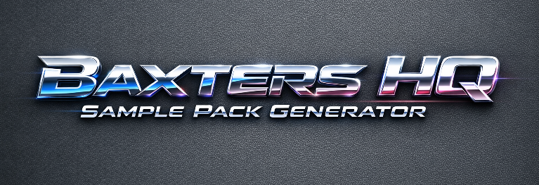

# Baxter's HQ Sample Pack Generator

A multi-stage audio pipeline for DJs, producers, and sound designers — separate stems, repair artifacts, and chop clean sample slices ready for your crates.

---

## Installation

1. Create a virtual environment and activate it:

```powershell
python -m venv .venv
.venv\Scripts\Activate.ps1
```

2. Install dependencies:

```bash
pip install -r requirements.txt
```

## GUI Usage

- Launch the GUI:

```powershell
run_hqspg.bat
```

- Use **Load** to pick a file or folder, **Save** to choose an output folder.
- Configure your pipeline stages in the **Flowchart** panel.
- Click **Run** to start. Open the **Debug Terminal** drawer for live logs.

## CLI Usage

The `bspg` package provides a pipeline entry point. For scripted runs, use `bspg.backend_adapter.cli_runner`.

## Outputs

Outputs are written to `<output_folder>/<track_name>/` with subfolders:

- `stems/` — raw separator outputs
- `repaired/` — repaired stems
- `samples/` — extracted slices per stem + `samples_manifest.json`

## Resume & Checkpoints

Runs write a `hqspg_state.json` after each stage so a pipeline can resume if interrupted.

## Packaging

A GitHub Actions workflow at `.github/workflows/build_windows.yml` builds a single Windows EXE via PyInstaller.

---

## Legal Responsibility Disclaimer

This software is provided as a research and tooling aid. Users are solely responsible for ensuring they have the legal right to process, deconstruct, or redistribute any audio they run through this pipeline. The authors accept no liability for infringement resulting from users' actions. When using the pipeline on copyrighted material, obtain necessary permissions or ensure your use qualifies as fair use under applicable law.

---

## Credits & Acknowledgements

**Built by:** Baxter ([@BaxtersLab](https://github.com/BaxtersLab))

**AI Co-Developer:** [Claude Sonnet 4.6](https://www.anthropic.com) by Anthropic — architecture decisions, pipeline logic, GUI wiring, and code review throughout development.

**This project stands on the shoulders of open-source giants:**

| Dependency | Purpose | License |
|---|---|---|
| [Demucs](https://github.com/facebookresearch/demucs) (Meta Research) | Stem separation | MIT |
| [PySide6](https://doc.qt.io/qtforpython/) (Qt / The Qt Company) | GUI framework | LGPL v3 |
| [PyInstaller](https://pyinstaller.org) | Windows EXE packaging | GPL v2 + bootloader exception |
| [NumPy](https://numpy.org) | Audio array processing | BSD 3-Clause |
| [SoundFile](https://python-soundfile.readthedocs.io) | Audio file I/O | BSD 3-Clause |
| [SoundDevice](https://python-sounddevice.readthedocs.io) | Audio playback | MIT |
| [Torch / torchaudio](https://pytorch.org) | ML backend for Demucs | BSD 3-Clause |

We don't take credit for the hard work behind these libraries. We're just making the open-source magic happen.

---

## License

This project is released under the MIT License — see the `LICENSE` file for details.

